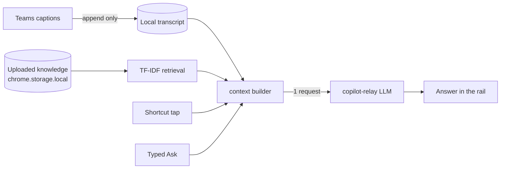

# MeetMate — grounded Q&A for Microsoft Teams

A Chrome extension that captures Microsoft Teams captions locally and answers
questions you actually ask, grounded in **this meeting's transcript** plus
**reference docs you uploaded**.

> Status: focused Q&A assistant.

---

## The one hard rule

**Captions never call the model.** Caption arrival appends to a local
transcript buffer and nothing else: no LLM call, no suggestion, no
autonomous loop, no heartbeat.

The model runs only when you ask, and every path goes through one function:

```js
ask(question)   // src/util.js
```



## What it does

- **Continuous local caption capture** — DOM observer plus a React-fiber
  poller (Teams V2 renders captions in a virtual list), deduplicated into one
  transcript.
- **Ask anything** — type a question in the rail, or tap a shortcut.
- **Shortcuts** — configurable `{label, prompt}` buttons. Defaults: Reply,
  Facts, Question, Challenge. Edited in Setup → Shortcuts.
- **Grounded answers** — the request carries the current transcript (bounded,
  most recent first) and the top knowledge passages retrieved by TF-IDF over
  chunked docs. The system prompt requires the model to distinguish
  transcript from knowledge, to avoid inventing unsupported facts, and to say
  plainly when the context does not support an answer.
- **Concise by design** — answers are 1–4 short sentences: they are read while
  somebody else is still talking.
- **Knowledge upload** — `.txt` / `.md` / `.json` / `.csv` / `.html` in
  Setup → Knowledge. Uploads are local-only (no model call): the text is
  stored as-is and retrieval stays a plain in-browser TF-IDF over chunks
  (no vector DB, no new dependency).
- **Transcript export** — the meeting transcript is written to a `.vtt` file
  on Leave.
- **Stripe Premium** — production builds open the existing Stripe-hosted
  Payment Link configured with `STRIPE_PAYMENT_LINK`. Stripe redirects to the
  public success page, which returns the user to `setup.html?session_id=cs_…`;
  the extension stores that Checkout session as a local soft entitlement. No
  Stripe secret is shipped in the extension, and development Preview is kept
  separate from real purchase state.

## What was removed (and is not coming back)

This is a deliberate scope cut, not a regression:

- the 4-state machine (`speaking` / `mentioned` / `attention`)
- the caption-triggered loop, heartbeat, and autonomous
  SUGGEST / RESEARCH / SILENT decisions
- the LLM-generated greeting and generated suggestion chips
- goal binding, auto-minutes, and the minutes appendix in the VTT
- cross-meeting AI memory and end-of-meeting memory distillation
- the demo/replay scenario runtime

## Architecture

```
src/content.js       meeting lifecycle, caption capture (DOM + React fiber),
                     rail mount, and the explicit ask handler
src/ui-controller.js the rail: shortcuts row, asked questions + answers,
                     Ask input. No state concept.
src/focused.js       pure helpers: shortcut normalization, transcript
                     formatting/bounding, knowledge chunking + TF-IDF search,
                     ask payload construction. No chrome/DOM access.
src/util.js          focused config/knowledge/ask helpers; `ask()` is the
                     single LLM entry point
src/relay.js         direct OpenAI-compatible client via background service worker
src/background.js    badge/icon, VTT export, Stripe Premium activation
src/setup.js         provider / shortcuts / knowledge
```

`ask(question)` in [src/util.js](src/util.js) does exactly this:

1. load the system prompt from [extension/agent-prompt.md](extension/agent-prompt.md)
   (falling back to the in-code default),
2. retrieve knowledge for `question + the most recent transcript lines`,
3. build one `system` + one `user` message
   ([src/focused.js](src/focused.js) `buildAskMessages`),
4. POST it once to the relay, and return the answer text.

The user message is always shaped like this:

```
[MEETING TRANSCRIPT -- most recent last]
Alice : Should we roll back before the customer call?
Bob : Prod has been OOM-ing every two hours since the deploy.

[RELEVANT KNOWLEDGE]
- (deploy-notes.md) The last deploy enabled the new cache layer.

[QUESTION]
What did Bob say about prod?
```

## Lifecycle

1. Captions turn on in Teams → `startTranscription()` → the rail mounts and
   captions start streaming into the local transcript.
2. The user taps a shortcut or types a question → `ask()` → the answer is
   appended under the question.
3. Leave → polling/mutation teardown → `stop_capture` → VTT export → rail
   removed.

## Build

```sh
# from team-mate/
npm install
npm run build           # webpack production + zip → team-mate.zip
npm test                # focused helper unit tests (node, no network)
npm run dev             # webpack --watch (no zip)
```

For a production payment build, set `STRIPE_PAYMENT_LINK` before building and
configure that Payment Link's success URL with Stripe's
`{CHECKOUT_SESSION_ID}` placeholder. Never put `STRIPE_SECRET_KEY` in this
repository or the extension bundle. The extension contains no ExtensionPay
runtime or dependency.

Load unpacked: `chrome://extensions/` → Developer mode → "Load unpacked" →
point at `team-mate/extension/`.

## Deploy CDN (marketing site)

```sh
# from team-mate/
```

Requires `QINIU_ACCESS_KEY` + `QINIU_SECRET_KEY` in `../.env.local`.

## Publish to Chrome Web Store

The extension is published via the Web Store developer console. The agent can
drive the upload with `agent-browser` against Chrome on port 9222 (the user's
logged-in session).

**Dev console:** <https://chrome.google.com/webstore/devconsole/b6ef2f52-fb3e-4af5-bbbf-ad73d2b79348>

```sh
npm run build
agent-browser open "https://chrome.google.com/webstore/devconsole/b6ef2f52-fb3e-4af5-bbbf-ad73d2b79348"
agent-browser snapshot                     # find the MeetMate row
agent-browser click "@<refOfMeetMate>"
agent-browser snapshot                     # "Package" tab
agent-browser click "@<refOfPackageTab>"
agent-browser snapshot                     # "Upload new package"
agent-browser setFile "input[type=file]" "$PWD/team-mate.zip"
agent-browser snapshot                     # then submit for review
```

Always bump `extension/manifest.json` `version` before building, or the Web
Store rejects the upload as "version not greater than previous".

## Configuration

All state lives in `chrome.storage.local`:

| Key | Shape | Purpose |
|---|---|---|
| `conf` | `{author, relayModel, shortcuts: [{label, prompt}], usageWarnThreshold, ...}` | Profile + rail shortcuts + model |
| `knowledge` | `{docs: [{id, name, size, addedAt, content}]}` | Uploaded reference docs |
| `usage` | `{cost, tokens}` | Cumulative LLM spend |

Shortcuts are stored as typed. `normalizeShortcuts()` drops blank rows, caps
the list at 8, and falls back to the four defaults so the rail is never empty.

## Tests

```sh
npm test
```

Covers the pure helpers only (no network, no DOM):

- `normalizeShortcuts` — defaults, trimming, dedupe, caps
- `formatTranscript` — line format, bounding, truncation marker
- `knowledgeSearch` — ranking, snippets, no-match behaviour
- `buildAskMessages` — transcript/knowledge/question blocks, no-knowledge
  note, grounding rules present, bounded payload, custom prompt fill-ins

## Manual E2E

1. Reload the extension at `chrome://extensions/`.
2. Setup: connect the account, pick a model, confirm the shortcuts list shows
   Reply / Facts / Question / Challenge, upload a knowledge doc.
3. Join a Teams meeting with live captions on. Confirm captions increment the
   badge and that **no** model call happens (relay logs stay empty).
4. Ask something in the rail and tap each shortcut. Each tap produces exactly
   one request, and the answer lands under the question.
5. Verify grounding: ask about something the transcript or knowledge covers
   (answer cites it) and something neither covers (answer says so).
6. Leave the meeting → rail disappears, `.vtt` downloads.

For automation, captions can be injected from DevTools:

```js
document.body.setAttribute('data-inject-caption', JSON.stringify({ Name: 'Bob', Text: 'Cutover slips to Nov 22.' }))
window.dispatchEvent(new CustomEvent('meetmate:ask', { detail: { question: 'Why does cutover move?' } }))
```

## License

UNLICENSED — proprietary.
