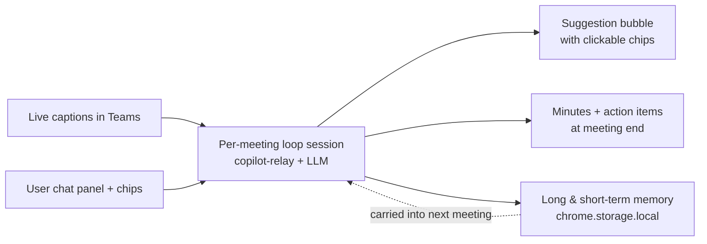
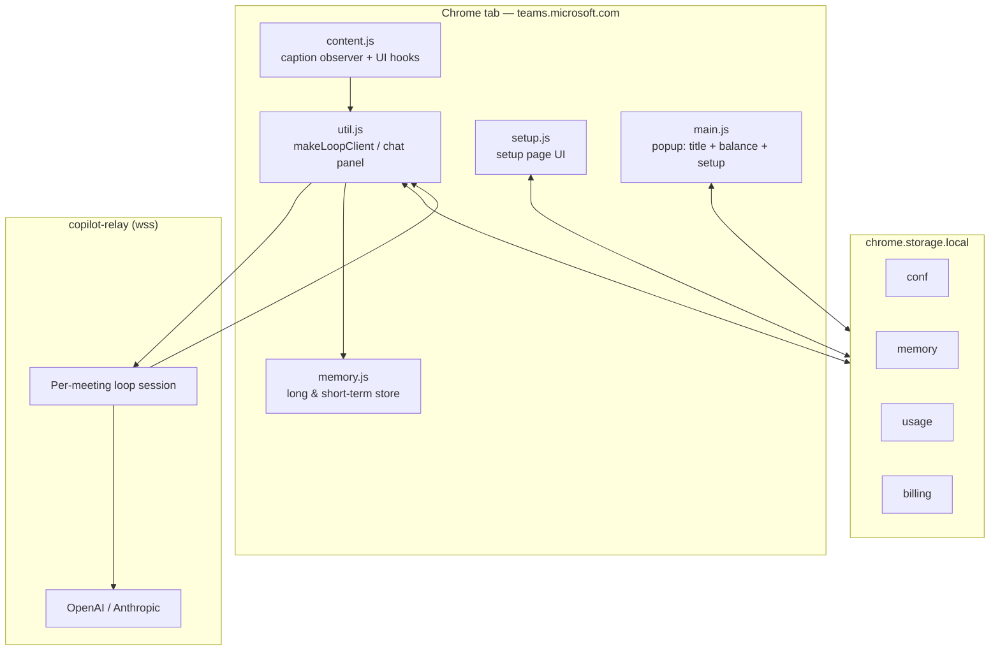
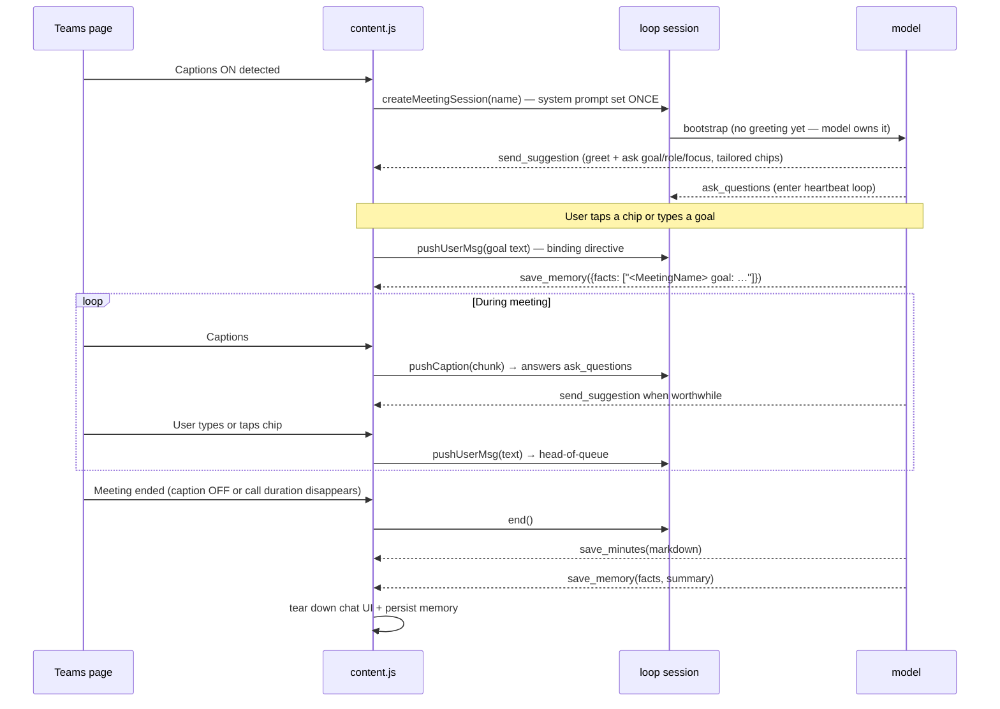

# MeetMate — MSTeams Meeting AI Assistant

A Chrome extension that turns Microsoft Teams meetings into a live conversation
with an AI assistant: real-time suggestions while captions stream, automatic
minutes & action items at the end, and durable memory that carries context
across meetings.

> Status: v3.0 — published to the Chrome Web Store.
> Marketing site: <https://cdn.qili2.com/pub/teams/index.html>

---

## What it does



- **Real-time suggestions** — the model decides on its own when to chime in
  (SUGGEST / RESEARCH / SILENT) based on streaming captions. Up to 2 bubbles
  per turn (e.g. RESEARCH definition + SUGGEST draft).
- **Steerable** — every suggestion comes with 1–4 situation-specific chips.
  Tapping a chip shows running → resolved (✓) / failed (✗) state and pushes
  the chip label into the loop as a `user_msg`.
- **LLM-driven greeting** — first bubble of every meeting is generated by the
  model from `{user_context}` and `{memory}`, asking for goal/role/focus with
  tailored chips. Picked goal becomes a binding directive AND is persisted
  via `save_memory` so recurring meetings recall it next time.
- **Cross-meeting memory** — long-term facts (people, decisions, recurring
  topics, per-meeting goals) and short-term recaps are auto-distilled at
  meeting end. Recent-meeting summaries are inline-editable in the setup
  page (autosaved, per-row × delete).
- **User-uploaded knowledge** — drop design docs, briefs, or notes
  (`.txt` / `.md` / `.json` / `.csv` / `.html`) into Setup → Knowledge.
  An LLM builds a 4-line wiki entry per doc which lives in the system
  prompt as `{knowledge_index}`. When the agent spots a topic that
  appears in the index, it calls `recall_knowledge` to fetch matching
  passages (TF-IDF over chunked text) and cites them in FACT bubbles.
- **User context** — a Markdown profile (About me / People I meet with / How
  I want the agent to help / Knowledge / Reference / Goals & Themes) plus a
  preferred-language selector are injected into every meeting.
- **🌐 Global Translate toolbar button** — one tap translates the current
  intent on the floor (last speaker's turn) into the user's preferred
  language; if meeting language differs from preferred, the agent also
  proactively polishes the user's own utterances in the meeting language.
- **Pay-as-you-go** — usage billed against a Stripe credits ledger. Top-up via Stripe live Payment Links ($1 / $10 / $100). After payment, Stripe redirects back to the extension's setup page with a `session_id`; the extension POSTs that session id to the relay's `/stripe/verify` endpoint, which calls Stripe API with the live secret key, confirms `payment_status=paid`, and returns the verified amount. The URL `credit` parameter is **ignored** (would otherwise be forgeable). Balance shown live in popup + setup page.

## Architecture

The full design is documented in two complementary specs:

- [docs/agent-design.md](docs/agent-design.md) — prompt anatomy, session
  lifecycle, where transcripts belong, memory layer, end-of-meeting distill
  loop.
- [docs/loop-session-design.md](docs/loop-session-design.md) — the
  cost-optimized v2 loop session that replaces per-call `session.create` +
  `chat`. Includes tool surface (`get_snapshot`, `send_suggestion`,
  `save_minutes`, `save_memory`), heartbeat invariant, suggestion bubble +
  chip UX, and cost model.



## Tool contract (loop session)

| Tool | Side | Purpose |
|---|---|---|
| `get_snapshot` | extension | Pull current transcripts, history, name, participants, memory on demand |
| `send_suggestion` | extension | Push a clickable bubble (kind: SUGGEST / RESEARCH / FACT; text + 1–4 chips). Up to 2 per turn. 60s text dedup. |
| `update_live_minutes` | extension | Replace contents of the side `📋` Live Minutes panel with full markdown. Call when a new decision/action/owner/deadline appears. |
| `set_phase` | extension | Update the top-center conversation state badge (intro / discussion / decision / qna / wrap). Call once per phase shift. |
| `save_minutes` | extension | End-of-meeting Markdown handoff (`minutes_ready` runtime message). |
| `save_memory` | extension | Distilled facts (long-term) + summary (short-term). Also called mid-meeting once to persist `<MeetingName> goal`. |
| `recall_knowledge` | extension | TF-IDF search over user-uploaded reference docs (`chrome.storage.local.knowledge`). Returns up to N `{doc, chunk, score, snippet}` matches. |
| `wait_for_event` | client loop | Terminal park — ends the HTTP turn; resumes on next event. |

## In-meeting UI surfaces

| Surface | Trigger | Purpose |
|---|---|---|
| `#aichat` chat panel | `aiChatButton` toggle / `send_suggestion` | Persistent assistant bubbles + free-text input. Chips show running → ✓ resolved / ✗ failed states. |
| `#liveMinutes` side panel | `liveMinutesButton` (📋) / `update_live_minutes` | Glanceable Decisions / Action items / Open questions. Auto-shows on first update. |
| `#phaseBadge` top-center pill | `set_phase` | Shows current conversation phase + short note. Color-coded per phase. |
| `🌐 translateButton` | manual click | One-shot translation of current intent on the floor → user's preferred language (set in setup page). |
| `#meetmate-status` toast | various | Subtle, auto-fading status (caption count, connected, minutes-saved). |

## Lifecycle



## File map

| Path | Responsibility |
|---|---|
| [extension/manifest.json](extension/manifest.json) | MV3 manifest (storage, activeTab, tabs perms) |
| [extension/agent-prompt.md](extension/agent-prompt.md) | System prompt template — placeholders: `{name}`, `{author}`, `{participants}`, `{meeting_meta}`, `{user_context}`, `{preferred_language}`, `{memory}`, `{knowledge_index}` |
| [extension/setup.html](extension/setup.html) | Setup page — account / agent / memory / knowledge cards |
| [extension/main.html](extension/main.html) | Browser action popup — title + balance + setup |
| [extension/_locales/](extension/_locales/) | i18n: de, en, es, fr, jp, ko, ru, zh_CN |
| [src/content.js](src/content.js) | Caption observer, debouncer, lifecycle |
| [src/util.js](src/util.js) | `makeLoopClient`, chat panel, meeting metadata |
| [src/loop-session.js](src/loop-session.js) | Loop client wrapper around CopilotRelayClient |
| [src/memory.js](src/memory.js) | Long/short memory store + `replaceMemory` |
| [src/billing.js](src/billing.js) | Stripe credits ledger |
| [src/setup.js](src/setup.js) | Setup page logic — userContext template, memory editor, top-up |
| [src/main.js](src/main.js) | Popup logic — usage + billing balance |
| [src/background.js](src/background.js) | Service worker — initConf, message routing, Stripe link |
| [scripts/upload_cdn.py](scripts/upload_cdn.py) | Qiniu CDN uploader for `www/` |
| [www/](www/) | Marketing site (index, privacy, support) hosted at `cdn.qili2.com/pub/teams/` |

## Build

```sh
# from team-mate/
yarn install
yarn build              # webpack production + zip → team-mate.zip
```

For development with watch mode:
```sh
yarn dev                # webpack --watch (no zip)
```

Load unpacked: in Chrome go to `chrome://extensions/`, enable Developer mode, "Load unpacked" → point at `team-mate/extension/`.

## Deploy CDN (marketing site)

```sh
# from team-mate/
yarn qiniu              # uploads www/ to cdn.qili2.com/pub/teams/
```

Requires `QINIU_ACCESS_KEY` + `QINIU_SECRET_KEY` in `../.env.local`.

## Publish to Chrome Web Store (auto-upload via agent-browser)

The extension is published to the Chrome Web Store via the developer console. The agent can drive the upload flow itself using `agent-browser` against Chrome on port 9222 (the user's logged-in Chrome session).

**Prerequisites:**
- Chrome running with `--remote-debugging-port=9222` and the developer's Web Store account already logged in
- Built artifact at `team-mate/team-mate.zip`

**Dev console URL:**
<https://chrome.google.com/webstore/devconsole/b6ef2f52-fb3e-4af5-bbbf-ad73d2b79348>

The trailing UUID is the developer group / extension ID — keep it stable across uploads. The console lists every extension owned by this developer; navigate into "MeetMate" and use "Package" → "Upload new package" to upload `team-mate.zip`. After upload, click "Submit for review".

**Agent self-upload procedure:**
```sh
# 1. Build first
cd team-mate && yarn build

# 2. Open the dev console
agent-browser tab new
agent-browser open "https://chrome.google.com/webstore/devconsole/b6ef2f52-fb3e-4af5-bbbf-ad73d2b79348"

# 3. Use snapshot to find the MeetMate row, click into it,
#    locate "Package" tab, then "Upload new package" button.
agent-browser snapshot                     # find @ref of the link/button
agent-browser click "@<refOfMeetMate>"
agent-browser snapshot                     # find @ref of "Package" tab
agent-browser click "@<refOfPackageTab>"
agent-browser snapshot                     # find @ref of "Upload new package"

# 4. Upload the zip via the file input. agent-browser has `setFile` for inputs:
agent-browser setFile "input[type=file]" "$PWD/team-mate.zip"

# 5. Wait for processing, then submit:
agent-browser snapshot                     # find @ref of "Submit for review"
agent-browser click "@<refOfSubmit>"
```

**Important:** Always bump `extension/manifest.json` `version` (and the corresponding string in `package.json` if applicable) before building, otherwise the Web Store rejects the upload as "version not greater than previous".

If `agent-browser snapshot` doesn't show the elements (e.g. shadow DOM), use `agent-browser inspect` to open DevTools and pick refs manually, or fall back to clicking via CSS selectors that survive the polymer shells (the dev console uses Material Design components — class names are stable enough between uploads).

## Configuration

All state lives in `chrome.storage.local`:

| Key | Shape | Purpose |
|---|---|---|
| `conf` | `{author, userContext, preferredLanguage, model, usageWarnThreshold, ...}` | User profile + agent settings |
| `memory` | `{long: string[], short: {ts, name, summary}[]}` | Cross-meeting memory |
| `usage` | `{cost, tokens}` | Cumulative LLM spend |
| `billing` | `{credits, creditedSessions}` | Stripe top-up ledger |

`userContext` is initialized to a 5-section Markdown template (About me /
People I meet with / How I want the agent to help / Knowledge / Reference /
Goals & Themes) — fully editable in the setup page.

## License

Proprietary. © Cheng Li.

---

## E2E test (manual)

Quick smoke test to run after a build / before publishing.

### Reload the extension

1. Open `chrome://extensions/`
2. Click **Reload** on the **MeetMate** card

### Setup page

1. Open the popup → **Setup**
2. Verify:
   - **MeetMate Settings** heading + 4 cards (Account, Usage, Agent, Memory)
   - Low-balance threshold spinbutton defaults to `0.5`
   - User context textarea is auto-seeded with the 5-section Markdown
     template; **Reset to template** button present
   - Memory long-term textarea is editable; **Clear** button works

### Meeting (real run)

> **Important:** use the existing logged-in Teams tab at
> `https://teams.microsoft.com/v2/`. Do not close it.
>
> **Always re-join the same meeting** — `"Meeting with Raymond Li"` — for
> every E2E pass. Re-using the same meeting keeps the memory baseline
> stable so you can spot regressions in long-term fact accumulation and
> short-term recap quality across runs.

1. **Chat** → click **`Meeting with Raymond Li`** → **Join** →
   **Join now**
2. After captions start (Teams turns them on automatically via the
   extension), verify in the meeting view:
   - Floating bubble appears **with the model's greeting** (intro,
     capabilities, optional questions, 2–4 chips). The greeting also
     appears in the chat panel.
   - Tapping a chip enqueues the chip label as a `user_msg`
   - Typing in the chat panel → reply lands within ~5s
   - Captions roll → SUGGEST/RESEARCH bubbles fire only when worthwhile
3. **Leave** the meeting. Verify:
   - Chat panel `#aichat` and floating action button container disappear
   - `#liveAI-message` bubble is cleared
   - At chrome://extensions/ → **service worker** console: `minutes_ready`
     message logged; `chrome.storage.local.memory` updated with new
     `short[]` recap and any new `long[]` facts

### Errors panel

After all of the above, `chrome://extensions/?errors=<id>` should show
**zero uncaught errors** (a stale "Extension context invalidated" from
before reload is expected and harmless).

### Replay scenarios (in DevTools console)

The full set of synthetic transcripts lives in
[tests/fixtures/scenarios.json](tests/fixtures/scenarios.json) and is
mirrored into `TEST_SCENARIOS` inside [src/content.js](src/content.js)
so the content script can replay without `fetch`.

Trigger from any meeting tab's DevTools console:

```js
window.dispatchEvent(new CustomEvent('meetmate:replay', { detail: '<name>' }))
window.dispatchEvent(new CustomEvent('meetmate:tap_chip', { detail: '<chip label>' }))
window.dispatchEvent(new CustomEvent('meetmate:leave' }))
```

| Scenario | Feature exercised | Expected behaviour |
|---|---|---|
| `silence_chitchat` | quiet baseline | No SUGGEST/RESEARCH; only LLM greeting + status pill |
| `silence_others_focus` | quiet baseline | Stay silent — Raymond not addressed |
| `direct_question` | trigger 1 (direct question) | One SUGGEST draft with concrete chips |
| `project_grounded` | userContext grounding | SUGGEST names "Phoenix" + "Nov 15" |
| `language_barrier` | Mandarin draft | SUGGEST in Mandarin (legacy — use 🌐 toolbar now) |
| `unfamiliar_jargon` | trigger 2 (jargon) | RESEARCH with 1-line definition |
| `user_commitment` | trigger 4 (commitment) | Quiet capture only — no chat bubble |
| `fact_correction` | memory.long correction | RESEARCH with correct number + polite phrasing |
| `request_for_advice` | trigger 1 (advice) | RESEARCH with 3 ranked causes |
| `end_meeting_wrap` | end-of-meeting | Minutes pill + memory.short entry; tears down on Leave |
| `bootstrap_greeting_no_memory` | LLM greeting | First bubble asks goal with tailored chips |
| `goal_recall_recurring` | memory recall | First chip = "Same as last time — …" |
| `goal_binding_persists` | mid-meeting `save_memory` | Chip tap → `save_memory({facts:["<Name> goal: …"]})` within ~2s |
| `multi_bubble_jargon_question` | ≤2 bubbles/turn | RESEARCH first, then SUGGEST in same turn |
| `user_mentioned_passive` | trigger 5 (mention) | Lightweight acknowledge bubble — not full draft |
| `speech_polish_language_match` | trigger 6 strict | Polish only when >15 words + awkward |
| `speech_polish_language_mismatch` | trigger 6 aggressive | Polish at >5 words → output in `preferredLanguage` |
| `translate_button_current_intent` | 🌐 toolbar | Translates last speaker's turn only — not bulk dump |
| `live_minutes_decision_action` | `update_live_minutes` | 📋 panel auto-shows with Decisions / Action items / Open questions |
| `phase_transitions_full_arc` | `set_phase` | Badge color cycles intro → discussion → decision → wrap |
| `chip_click_lifecycle` | chip states | Amber spinner → green ✓ on resolve; red ✗ on failure |

Two **special transcript markers** drive UI from inside a scenario
instead of pushing a caption:

- `{Name: '__chip_tap__', Text: '<chip label>'}` — taps the matching
  live chip
- `{Name: '__toolbar_click__', Text: '<role>'}` — clicks the toolbar
  button with that role (e.g. `translate`, `minutes`)

Scenarios with a `preconditions` block (e.g. `goal_recall_recurring`,
`speech_polish_*`) require manual setup of `chrome.storage.local.memory`
or `conf.preferredLanguage` before replay — set them via the Setup page
or DevTools.

#### Last live verification

Driven against a real Teams meeting on 2025-04-25 (gpt-4.1, port 9222
agent-browser, "Meeting with Raymond Li"). Result: **10/11 PASS**.

| # | Scenario | Result |
|---|---|---|
| 1 | `bootstrap_greeting_no_memory` | ✅ |
| 2 | `goal_recall_recurring` | ✅ |
| 3 | `goal_binding_persists` | ✅ |
| 4 | `multi_bubble_jargon_question` | ✅ |
| 5 | `user_mentioned_passive` | ✅ defensible silence |
| 6 | `speech_polish_language_match` | ✅ |
| 7 | `speech_polish_language_mismatch` | ✅ |
| 8 | `translate_button_current_intent` | ⚠️ both lines translated, but as 2 bubbles vs 1 — prompt fix shipped, not yet re-verified |
| 9 | `live_minutes_decision_action` | ✅ |
| 10 | `phase_transitions_full_arc` | ✅ |
| 11 | `chip_click_lifecycle` | ✅ |

