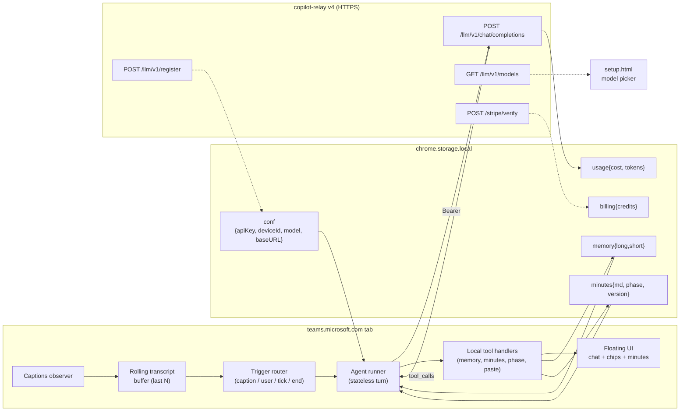
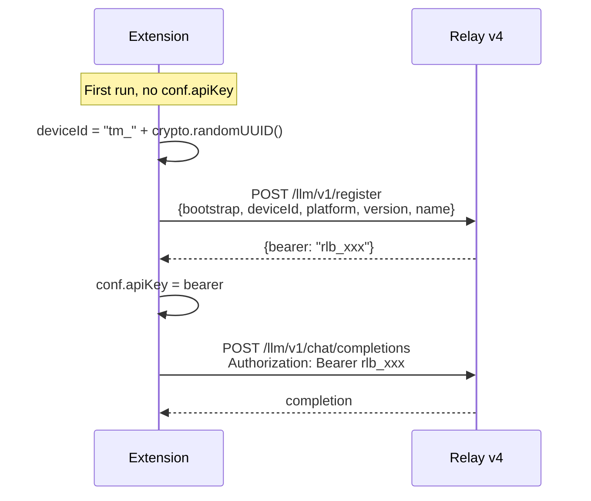

# MeetMate Agent — v4 Design (RelayLLM, no loop session)

Status: **design draft** · supersedes
[`loop-session-design.md`](loop-session-design.md) and section 2b of
[`agent-design.md`](agent-design.md).

> **Why a rewrite?** Copilot-Relay v4 dropped the JSON-RPC `session.*`
> surface. The relay is now a thin OpenAI-compatible proxy
> (`POST /llm/v1/chat/completions`, `GET /llm/v1/models`,
> `POST /llm/v1/register`, `POST /stripe/verify`). There is **no
> server-side session, no `ask_questions` heartbeat, no external-tool
> callback channel**.
>
> **We still want a loop.** The v3 model UX — a single conversation
> per meeting where the assistant remembers what it has already said
> and decides per-event whether to speak — is the product. The
> rewrite keeps that **conceptual** loop, but moves the
> session-state from the relay into the **client** and drives it via
> a "neverstop" protocol baked into the system prompt: the model is
> instructed never to terminate without calling a tool, and the
> client owns the message-history across HTTP turns.

---

## 1. Goals (unchanged from v3)

1. **Live captions in → contextual suggestions out.** The user pastes a
   suggestion into Teams chat with one click.
2. **Long-form chat panel.** Free-form questions about the meeting.
3. **End-of-meeting minutes.** A structured markdown block (Summary,
   Decisions, Action Items, Open Questions) appended to the exported VTT
   as a trailing `NOTE Minutes` block when the user leaves the meeting.
4. **Phase chip.** "Intro / Discussion / Decision / Wrap-up".
5. **Memory across meetings.** Long-term facts + 10 most-recent meeting
   summaries.
6. **User context.** Persistent prefs ("I'm the PM, answer in EN").
7. **BYOK escape hatch.** Power user can point at any
   OpenAI-compatible base URL.

## 2. Non-goals

- Server-side session persistence (gone in v4).
- Relay-side tool execution (gone). Every tool runs in the extension.
- Anonymous use. The extension MUST register a device first.

---

## 3. New architecture



**Key change:** there is no persistent server-side conversation. The
client owns *all* state and rebuilds the prompt each turn from local
storage. Each "turn" is one round-trip (or a short
tool-call → tool-result → final-text mini-loop in the same HTTP call
via OpenAI native function calling).

---

## 4. The Agent Loop (neverstop protocol)

The agent is a single **client-side loop**, one per meeting,
implemented as a long-lived `messages[]` array in a tab-scoped object
(`_loop`). The relay is stateless: each HTTP call carries the entire
history. The model is instructed (system prompt) to **never return a
final assistant message** — it must always call a tool. The
`wait_for_event` tool acts as the "park" point that ends the current
HTTP turn and yields control to the client until the next event
arrives.

```mermaid
sequenceDiagram
  participant Cap as Captions / User / Tick
  participant Loop as Client loop (_loop)
  participant Relay as /llm/v1/chat/completions
  participant Model as LLM

  Note over Loop: _messages = [system]<br/>_eventQueue = []
  Cap->>Loop: caption "Alice: hi"
  Loop->>Loop: enqueue {kind:"caption",...}
  Loop->>Loop: append user-msg = next event
  Loop->>Relay: POST {messages, tools}
  Relay->>Model: forward
  Model-->>Relay: tool_call: send_suggestion(...)
  Relay-->>Loop: response
  Loop->>Loop: run send_suggestion locally
  Loop->>Loop: append assistant + tool result
  Loop->>Relay: POST {messages with tool result}
  Model-->>Loop: tool_call: wait_for_event()
  Note over Loop: PARK. HTTP turn ends.<br/>messages persists in _loop
  Cap->>Loop: user_msg "summarize"
  Loop->>Loop: append tool-result = {kind:"user_msg",text:"summarize"}
  Loop->>Relay: POST (history grows)
  Model-->>Loop: assistant text + wait_for_event()
  Loop->>Loop: render, park again
```

### 4.1 Triggers (unchanged from v3)

| Trigger | Source | Debounce | Default budget |
|---|---|---|---|
| `caption` | new captions in buffer | 4 s window or ≥3 lines | 1 turn / 10 s |
| `user_msg` | user types in chat panel | immediate | unbounded (user-paid) |
| `tick` | every 60 s while meeting active | 60 s | 1 turn / 60 s |
| `end` | meeting tab closed / "End" clicked | immediate | 1 final distill turn |

### 4.2 Loop algorithm

```text
loop_start(meeting):
  _messages = [system_prompt_built_from_local_state()]
  _eventQueue = []
  // bootstrap: ask the model to greet, then call wait_for_event
  _messages.push({role:"user", content:"Meeting started."})
  await runUntilPark()

on_event(evt):
  _eventQueue.push(evt)
  if !_running: await drain()

drain():
  _running = true
  while _eventQueue.length:
    evt = _eventQueue.shift()
    // resume from the parked wait_for_event tool_call
    _messages.push({role:"tool", tool_call_id:_parkedId, content: JSON.stringify(evt)})
    await runUntilPark()
  _running = false

runUntilPark(maxHops = 8):
  for hop in 0..maxHops:
    res = POST /llm/v1/chat/completions {messages:_messages, tools, model}
    msg = res.choices[0].message
    _messages.push(msg)
    if !msg.tool_calls: throw "model must call a tool (neverstop violation)"
    for tc in msg.tool_calls:
      if tc.name == "wait_for_event":
        _parkedId = tc.id
        return  // park: end HTTP loop
      result = await runToolLocally(tc.name, tc.args)
      _messages.push({role:"tool", tool_call_id:tc.id, content: JSON.stringify(result)})
  throw "neverstop loop exceeded hops without parking"
```

### 4.3 History compaction

Per-meeting `_messages` grows unbounded. To cap token cost:

- After every **200 000 tokens** of cumulative prompt tokens used in
  this meeting (tracked via `response.usage.prompt_tokens`),
  the client appends a special user message:
  `[COMPACT] Summarize everything above into a 1 000-token
  paragraph. Emit any new facts via save_memory BEFORE returning the
  summary. Then call wait_for_event.`
- The model runs those tools, then parks. The client takes the model's
  assistant text (the summary), replaces `_messages[1:]` with a single
  synthetic user message `[COMPACTED]\n<summary>\n`, and resumes.
- Memory already persists independently in storage, so the compaction
  is lossless on the things that matter.

200K tokens is sized to comfortably fit the context window of any
modern frontier model (gpt-4.1/o-mini are 200K+, claude-sonnet is
200K, gemini is 1M) while leaving headroom for the response. Tune
down (e.g. 100K) for models with smaller windows by reading
`/llm/v1/models` metadata if it exposes `context_window`.

---

## 5. System prompt (built once at loop start)

```
You are MeetMate, an in-meeting assistant.

## NEVERSTOP PROTOCOL
You are in a long-running loop driven by an external event stream.
Rules — these are non-negotiable:

1. NEVER end your reply with a plain assistant message. Every reply
   MUST end with at least one tool call.
2. The terminal tool of every reply is `wait_for_event`. Call it when
   you have no more side-effects to perform; it pauses you until the
   next event (caption, user_msg, tick, or end).
3. Side-effect tools (`send_suggestion`, `save_memory`,
   `save_minutes`) MUST come BEFORE `wait_for_event` in
   the same reply.
4. The `wait_for_event` result will arrive as a tool-message with
   shape `{"kind":"caption"|"user_msg"|"tick"|"end", ...payload}`.
   React to it on the NEXT reply.
5. On `kind:"end"`, call `save_memory` then `wait_for_event` one last
   time; the client will close the loop.
6. If you have NOTHING useful to say for a caption event, just call
   `wait_for_event` immediately — no `send_suggestion`. Silence is
   the default.

## User context
{conf.userContext or "(none)"}

## Memory
### Long-term facts (top 100)
{memory.long bullet list}
### Recent meetings (last 10)
{memory.short bullet list}

## Current meeting
- Name: {meetingName}
- Started: {startedAt}
- Participants: {getParticipants() joined}
```

Note: recent captions are NOT in the system prompt. They flow in via
the `tool` messages that resume from `wait_for_event` (each event
payload includes the latest caption chunk). This keeps the system
prompt small and stable, which lets the LLM cache it.

---

## 6. Tools (OpenAI function-calling, all client-side)

Sent in every `chat.completions` request as `tools: [...]`. The
relay-v4 proxy forwards `tools` and `tool_choice` unchanged.

| Tool | Args | Handler |
|---|---|---|
| **`wait_for_event`** | `{}` | **Park.** Client ends the HTTP turn; persists `_messages` in tab state; resumes on next event by appending a `tool` message with the event payload. |
| `send_suggestion` | `{text, options?: string[]}` | Render a toast with copy buttons. |
| `save_memory` | `{long_facts: string[], short_summary: {name, ts, summary}}` | `mergeLong` + `appendShort` from `memory.js`. |
| `save_minutes` | `{markdown}` | End-of-meeting handoff: captured into `_lastMinutes` and appended to the exported VTT as a trailing `NOTE Minutes` block. |
| `get_snapshot` | `{}` | Returns `{transcripts, history, minutes}` — escape hatch when the model needs more than the streaming event view. |
| `recall_knowledge` | `{query: string, limit?: number}` | TF-IDF search over user-uploaded reference docs (`chrome.storage.local.knowledge`). Returns up to N `{doc, chunk, score, snippet}` matches. See §8 (Knowledge). |

`wait_for_event` is the **only** way the model can yield control —
returning a plain assistant message without any tool call is treated
as a protocol violation and the client appends a `user`-role
"reminder: you must call a tool" and retries (max 1 retry).

---

## 7. State management

### 7.1 `conf` (already in `shared.js`)
Add fields: `deviceId`, `apiKey` (bearer from register), `model`,
`baseURL?`, `userContext`.

### 7.2 `memory` (already in `memory.js`)
**Unchanged.** Local-only. Tools `save_memory` / `mergeLong` /
`appendShort` write here.

### 7.3 minutes (end-of-meeting only)
The `save_minutes` tool fires once on the `end` event. Its markdown
is captured into `_lastMinutes` in `content.js` and appended to the
exported VTT as a trailing `NOTE Minutes` block by `background.js#save`.
There is no live side panel — the live-minutes feature was retired
in v4.3.

### 7.4 `history` (in-memory per tab)
The chat panel's user-visible turn log. Capped at last M=20 turns.
Cleared on meeting end. Used for chat-panel continuity, NOT for
caption-triggered turns (those are stateless re: history — they only
see captions + memory + minutes).

### 7.5 `usage` (already in `relay.js`)
**Unchanged.** Increment from `response.usage` in chat-completion
replies.

### 7.6 `knowledge` (chrome.storage.local, key `knowledge`)

User-uploaded reference documents.

```
{
  docs: [
    { id, name, size, addedAt, content, wikiEntry }
  ]
}
```

- **content**: plain text extracted from upload (`.txt`/`.md`/`.json`/`.csv`/`.html`).
  PDFs are rejected with a hint to use convertio.co. Total cap ~5 MB
  (Chrome local-storage budget).
- **wikiEntry**: a short 4-line LLM-built summary (Title / Keywords /
  Sections / Summary, ≤ 600 chars). Generated on upload via
  `relayChat()` and again on demand via the per-doc **Re-index**
  button. Falls back to `first-200-chars + "…"` when empty.

#### Wiki-index injection

`formatKnowledgeIndex()` concatenates every doc's wikiEntry into a
single block and is injected into the system prompt as
`{knowledge_index}` for both the main agent and `makePredictAPI`.
This gives the model a corpus-level table-of-contents on every turn
*without* paying for full doc content.

#### `recall_knowledge` retrieval

When the model spots a topic that appears in the index, it calls
`recall_knowledge({query, limit?})`. The handler:

1. Loads `knowledge.docs` from `chrome.storage.local`.
2. Tokenizes (`knowledgeTokenize`): lowercase, keep `[a-z0-9_]` + CJK,
   drop tokens < 2 chars.
3. Chunks each doc (`knowledgeChunk`): ~600-char overlapping windows,
   broken at paragraph / sentence boundaries when one exists past the
   halfway mark.
4. Computes TF-IDF over chunks (each chunk = one "document"). Score per
   chunk = Σ over unique query tokens of `(1 + ln(tf)) · idf`,
   `idf(t) = ln((N+1)/(df+1)) + 1`.
5. Sorts, dedupes near-duplicates (same doc + adjacent chunk index),
   returns top-K snippets `{doc, chunk, score, snippet}` (snippet ≤ 500
   chars, whitespace-collapsed).

No persistent index — chunking is done in memory on each call. For ≤ a
few hundred chunks this is sub-millisecond; switch to persisted chunks
+ DF when the corpus grows past that.

---

## 8. Auth & bootstrap



- `BOOTSTRAP_TOKEN` is a build-time constant baked into the bundle.
- `deviceId` is stable per-install (regenerated only on
  reinstall/clear-storage).
- Re-registration with the same `deviceId` is idempotent (returns same
  bearer).
- BYOK path: if `conf.baseURL` is set, skip register; pass
  `conf.apiKey` straight through.

---

## 9. Billing & top-up (unchanged from current)

1. Setup page shows three Stripe Payment Links ($1 / $10 / $100).
2. User pays; Stripe redirects to
   `setup.html?session=<CHECKOUT_SESSION_ID>`.
3. `applyCredit({sessionId})` POSTs to `/stripe/verify` (no auth) →
   server returns `{ok, amountTotalCents}`.
4. Local `billing.credits` increments by `amountTotalCents / 100`.
5. Balance displayed = `billing.credits − usage.cost`.

No relay-side ledger. Client-authoritative.

---

## 10. Model picker

`setup.html` now fetches `GET ${baseURL or relay}/llm/v1/models`
(OpenAI shape: `{data: [{id, ...}]}`). Picker writes the chosen id to
`conf.model`. Default = first model marked `default:true` in the
response, falling back to `gpt-4.1`.

The picker also shows pricing (if the relay's `/models` extension
fields include `prices.input`/`prices.output`) and capability badges
(🧠 reasoning, 👁 vision).

---

## 11. Module map

| Module | Status | What it does |
|---|---|---|
| `src/loop-session.js` | **REWRITE** | Becomes the neverstop client-side loop driver. Same public API (`createLoopSession({...}) → {start, pushCaption, pushUserMsg, pushTick, end, onUsage}`) so `content.js` integration barely changes. Internally: long-lived `_messages[]`, calls `chatCompletion()` from `relay.js`, parks on `wait_for_event`, runs tools locally. **No WebSocket.** |
| `src/relay.js` | **REWRITE** | Becomes thin `chatCompletion({messages, tools, model})` over HTTPS + register bootstrap + usage tracker. Drops `CopilotRelayClient` import. Keep `STRIPE_PAYMENT_LINKS`, `getUsage`/`resetUsage`. |
| `src/util.js` | **EDIT** | Drop the WS-specific bits of `makeLoopClient` (it stays, but delegates to the new `createLoopSession`). Keep `buildSystemMessage`, `makePredictAPI`, `createUI`. |
| `src/content.js` | **minimal edit** | Keep the `_loop` / `pushCaption` / `onSuggestion` plumbing — the contract is unchanged. Only the implementation behind it changes. |
| `src/memory.js` | unchanged | |
| `src/billing.js` | unchanged | |
| `src/setup.js` | **EDIT** | Swap models endpoint; show device-registration status. |
| `src/shared.js` | **PRUNE** | Delete dead qili* (`predict`, `predict1`, `qiliFetch`, `upload`, `getBalance`, `getUserId`, qili `buy`). Keep `initConf`, `getConf`, `changeConf`, `prompt`, `initSetupPage`, `Qili_Icon_Svg`. |
| `extension/agent-prompt.md` | **REWRITE** | Neverstop protocol prompt (see §5). Drop the `ask_questions` heartbeat references; replace with `wait_for_event` semantics. |
| `extension/manifest.json` | **EDIT** | host_permissions = `["https://relay.ai.qili2.com/*"]`. |

New module:

| Module | What |
|---|---|
| `src/auth.js` | `getDeviceId()`, `registerDevice()`. Called once on bundle init by background.js. |

---

## 12. Open questions

1. **Bootstrap token discoverability.** Should `BOOTSTRAP_TOKEN` be a
   public constant + rate-limited registration, or a per-build secret
   in the published `extension/manifest.json` key?
2. **Rolling window N.** Default 80 captions feels right but no
   measurement yet. Could be model-aware (gpt-5: 200; o-mini: 50).
3. **Caption-trigger debounce vs cost.** 4 s window means a fast
   meeting (4 captions / 10 s) costs $X / hour at gpt-4.1 prices.
   Need a real measurement before shipping the auto-suggest UX.
4. **Tool-loop budget.** 3 hops per turn is a guess; may need to
   bump for `save_minutes` + `save_memory` simultaneously (on `end`).
5. **`get_snapshot` necessity.** If the rolling window is well-sized,
   is `get_snapshot` ever needed? Could be removed in v1.

---

## 13. Migration / rollout

Single-shot rewrite, no compat shim — v3 and v4 cannot coexist (one
WS-only, one HTTPS-only). Cut a v4.0.0 release.

**Refactor checklist** (each step ships a green build):

1. [ ] Delete qili* dead code from `shared.js`.
2. [ ] Add `src/auth.js` with `getDeviceId` + `registerDevice` +
       `BOOTSTRAP_TOKEN` constant.
3. [ ] Rewrite `src/relay.js`: drop WS / `CopilotRelayClient`; export
       `chatCompletion({messages, tools, model})` over HTTPS; keep
       usage tracker + Stripe links.
4. [ ] Rewrite `src/loop-session.js` as the neverstop driver: same
       public API, `_messages[]` state, `chatCompletion`-backed,
       parks on `wait_for_event`.
5. [ ] Rewrite `extension/agent-prompt.md` with the neverstop
       protocol block (§5) and the new tool list (§6).
6. [ ] Swap models endpoint in `setup.js` to `/llm/v1/models`.
7. [ ] Update `manifest.json` host_permissions.
8. [ ] Add history compaction (§4.3) once basic loop is green.
9. [ ] Delete `docs/loop-session-design.md`; update
       `agent-design.md` with a pointer to this doc.
10. [ ] Bump `package.json` version to `4.0.0`, build, smoke-test.
